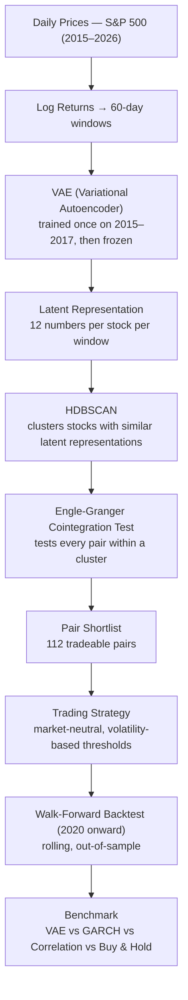

# An Unsupervised-Learning Approach to Adaptive Market-Neutral Pairs Trading

MSc Data Science dissertation project — Lalith Aditya Devaraj (KU ID 2551111), supervised by Dr. Gordon Hunter.

Pairs trading buys the laggard and shorts the leader in a pair of stocks that normally move together,
profiting when the temporary gap between them closes — regardless of which way the overall market
moves. The classical way to find those pairs is to eyeball price correlation. This project replaces
that step with **unsupervised representation learning**: a Variational Autoencoder (VAE) learns a
compact numerical description of how each stock behaves, HDBSCAN groups stocks that behave alike, and
only pairs inside those groups are tested for a statistically valid trading relationship.

**Status: 5 of 10 phases complete.** The full pipeline runs end-to-end and produces a working,
market-neutral strategy on held-out data. What remains is making it realistic over time (a rolling
walk-forward backtest, trading costs) and proving the extra machine-learning complexity is actually
worth it (benchmarking against simpler alternatives).

---

## Pipeline



The VAE is trained **once**, on 2015–2017 data only, and never retrained. Every window from 2018
onward is encoded by that frozen model — this is what keeps the later walk-forward backtest
look-ahead-free: the model genuinely never saw the future data it's evaluated on.

---

## Project status

| # | Phase | Status | Headline result |
|---|-------|--------|------------------|
| 1 | Data foundation | ✅ Done | 462 tickers (from 503), 2015–2026, 0 NaNs, tensor `(462, 47, 60)` |
| 2 | VAE training + latent inspection | ✅ Done | Frozen after training on 2015–2017; permutation test ρ=+0.48 (p=0.001); known pairs (JPM–BAC, KO–PEP, XOM–CVX, MA–V) recovered unsupervised |
| 3 | HDBSCAN clustering + stability | ✅ Done | 10 clusters, bootstrap ARI 0.86 ± 0.06; 8 stable clusters → 80 assets carried forward |
| 4 | Cointegration + pair selection | ✅ Done | 670 pairs tested → 114 significant → **112-pair shortlist** after quality gates |
| 5 | Trading strategy (single-pair + portfolio) | ✅ Done | Single pair (NTRS–RF): +42.8% cum., Sharpe 0.58. 10-pair portfolio: +12.3% cum., Sharpe 0.44, beta ≈ +0.09 (market-neutral confirmed) |
| 6 | Walk-forward backtest (frozen VAE, rolling) | ⏳ Next | Chains the pipeline into one continuous out-of-sample equity curve — the dissertation's headline result |
| 7 | Pair persistence & turnover | ⏳ Pending | How long pairs stay reliable; turnover vs a volatility proxy (VIX / realised vol) |
| 8 | Transaction costs | ⏳ Pending | Commission + slippage on every trade; net-of-cost equity curve |
| 9 | Benchmark: VAE vs GARCH vs Correlation vs Buy & Hold | ⏳ Pending | Re-runs the full chain with GARCH and a plain rolling-correlation selector in place of the VAE, to test whether the extra complexity earns its keep |
| 10 | Results compilation & write-up | ⏳ Pending | Final figures, tables, dissertation chapters |

Note: the Phase 9 benchmark originally planned to compare the VAE against PCA (a linear encoder). On
the supervisor's suggestion this was simplified to **GARCH** — a classical volatility model — as a
fairer, simpler "does the AI earn its keep" baseline.

---

## Problems encountered, and how they were fixed

**HDBSCAN's first attempt collapsed everything into one giant cluster.** No hyperparameter setting
produced sensible groups. Root cause, found by inspection: clustering was run on each stock's
*average* latent value across windows, which erases how *variable* a stock's behaviour is (a stable
utility and a volatile tech stock can average out to the same point). A second, compounding issue was
that one latent dimension had a much larger numeric scale than the others and dominated the distance
calculation. *Fix:* built an augmented fingerprint of `[mean, std]` per latent dimension, z-scored so
every dimension contributes equally, and switched HDBSCAN's `cluster_selection_method` from the
default `eom` (which greedily re-merges small, tight clusters back into a parent blob) to `leaf` (which
keeps them separate). This is what actually produced the 10 clean clusters in Phase 3.

**2 of the 12 VAE latent dimensions collapsed to the prior** (a known VAE failure mode — the encoder
learns to ignore those dimensions entirely, so they carry no information). Rather than shrink the
latent size or retrain with a different KL weighting, those 2 dead dimensions were simply **excluded**
from the downstream clustering fingerprint, keeping the other 10 active ones. Accepted and documented
as a known limitation rather than hidden.

**Engle-Granger and Johansen cointegration tests only agreed on ~50% of pairs.** Rather than requiring
both tests to agree (which would have thrown away many valid pairs sitting near the p≈0.05 boundary),
Johansen was used only as a **robustness check** on the top-ranked Engle-Granger pairs, exactly as
originally planned — not as a hard filter.

**14 single-day price moves greater than 50%** turned up during data cleaning. Instead of assuming
they were data errors and deleting them, each was checked individually — they were real events (e.g.
the PG&E wildfire-related crash) — and were **kept** rather than silently dropped.

**High noise ratio under HDBSCAN's `leaf` mode broke the standard cluster-quality metric** (DBCV
returns `NaN` at high noise levels). Cluster configurations were instead scored using silhouette score
computed on the non-noise subset only, with guardrails (silhouette > 0, ≥5 clusters, largest cluster
≤ 40% of non-noise points) to keep the search honest.

---

## What's left

- **Walk-forward backtest** — the current Phase 5 results are a single, static train/test split. Phase
  6 re-runs the whole chain on a rolling quarterly schedule across 2020+ (frozen VAE, but clusters and
  pairs refreshed every quarter) into one continuous, realistic equity curve.
- **Realistic costs** — all current returns are gross of trading costs.
- **Proving the ML step is worth it** — Phase 9 benchmarks the VAE against GARCH, plain
  rolling-correlation, and buy-and-hold, on identical windows and costs.

Target completion: September 2026.

---

## Repository structure

```
data/                      raw & processed price data, model-input tensors (gitignored — regenerated by the notebooks)
models/vae/                frozen VAE weights + training log
Meet/                       presentation materials (slides, script, phase-plan notes)
data_download.ipynb         Phase 1
data_cleaning.ipynb         Phase 1
feature_engineering.ipynb   Phase 1
vae_training.ipynb          Phase 2
latent_inspection.ipynb     Phase 2
hdbscan_clustering.ipynb    Phase 3
cointegration.ipynb         Phase 4
strategy.ipynb              Phase 5
dissertation_project_phases_v2.md   full 10-phase methodology
Project Proposal.docx       original approved research proposal
```

---

## Environment

```
pip install -r requirements.txt
pip install torch --index-url https://download.pytorch.org/whl/cu126
```

Developed on an NVIDIA RTX 3060 Laptop GPU (6 GB), CUDA 12.7, PyTorch cu126. Data via `yfinance`
(Yahoo Finance), free and licensed for research use.

---

## Ethics & limitations

All data is public, already-published market data — no personal data, no human participants, and no
real capital is traded. Results are a research output, not financial advice. Known limitation: the
ticker universe is the *current* S&P 500 constituent list rather than historical membership
(survivorship bias), which is expected to modestly inflate returns — disclosed here and in the
dissertation rather than hidden.
